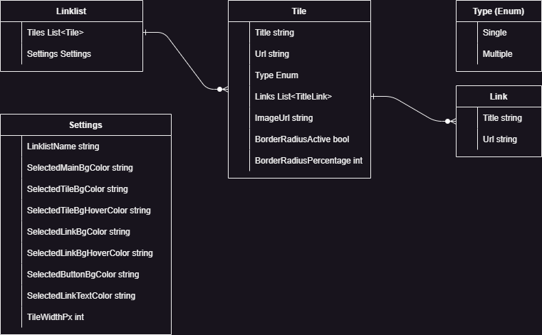

# Linklist Creator
The Linklist Creator is used to automatically create a link list. 

You can find an example of a link list here: 
https://www.hetfeld.name/Linklist/sample/

You can either compile the finished program yourself or download it here:
https://www.hetfeld.name/Linklist/LinklistCreator.7z

## Usage
The app starts with a predefined default link list.

### Tiles
The tiles are listed on the left-hand side.
Tiles can be added and removed here.

When a tile is selected, the settings for this tile are displayed. 
An image for the tile can also be uploaded here.
If “Multi” is selected, additional links can be created for the drop-down menu.

### Links
Links can be added or removed next to the tiles.

As soon as a link is selected, the settings for this tile are displayed.

### Design Options
In the design options on the right-hand side, the colors and the size of the tiles can be adjusted. The title of the link list is also defined here.

### Menu
The hamburger menu at the top left gives you the option to save the current configuration, load an existing configuration and create the files for the link list.

## Architecture
The app uses Blazor within a WPF frame.
.NET Core 9.0 is used

### Model

